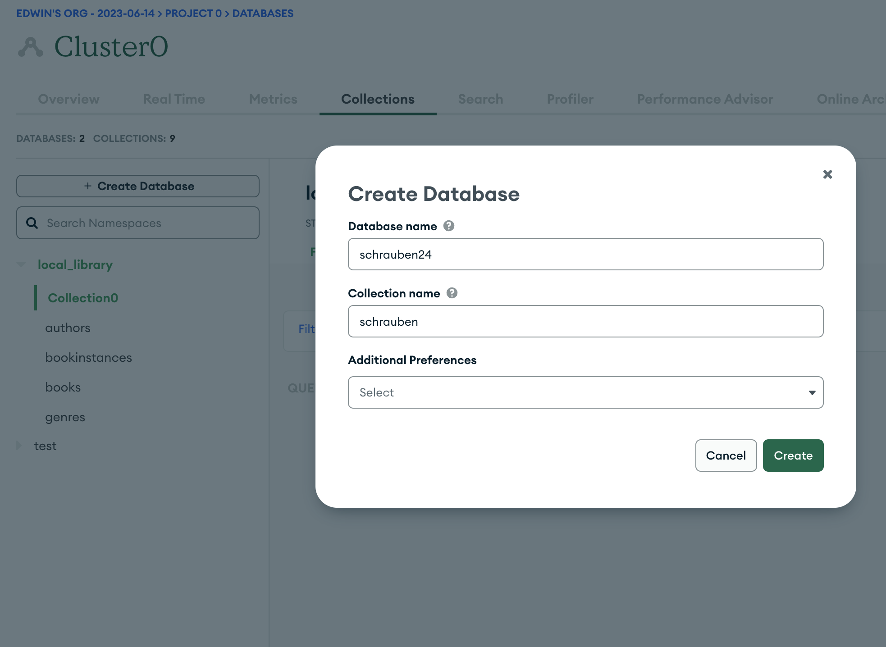
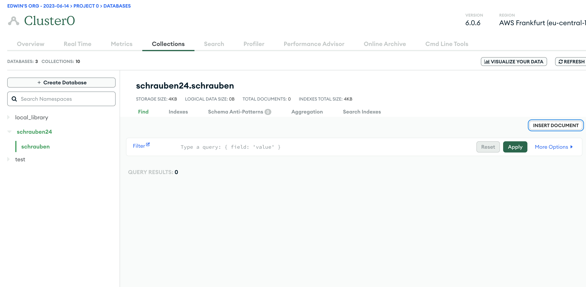

# Aufgabe: Schraubenverkaufs-Tracker

Deine Aufgabe besteht darin, einen einfachen Schraubenverkaufs-Tracker zu erstellen. Dieser Tracker sollte in der Lage sein, Daten über verkaufte Schrauben zu speichern und abzufragen.

## Teil 0: Importiere Daten in MongoDB Atlas

Importiere die Dummy Daten in `schrauben.json` in MongoDB Atlas.
Erstelle dafür eine neue DB und Collection:
- DB: `schrauben24`
- Collection: `schrauben`

In MongoAtlas klicke auf `+ Create Database` oben links.

Dann klicke rechts auf `Insert Document` und copy paste die Daten aus `schrauben.json`in die DB.

## Teil 1: Schema und Modell erstellen

1.1 Erstelle ein Mongoose Schema und ein Modell für einen "Verkauf". Dein Schema sollte die folgenden Felder haben:

- `schrauben_typ` (String)
- `verkaufsdatum` (Date)
- `menge` (Number)
- `preis_pro_einheit` (Number)
- `produkt_id` (String)

1.2 Erstelle außerdem eine virtuelle Eigenschaft namens `gesamtpreis`, die den Gesamtpreis des Verkaufs (die Menge multipliziert mit dem Preis pro Einheit) berechnet.

1.3 Erstelle eine Get-Request-Route in Express: 

  1. Eine Route, die die Verkaufsinformationen für eine bestimmte Schraube wiedergibt. Die Produkt-ID der Schraube sollte als URL-Parameter übergeben werden. Beispielsweise sollte ein Get-Request an `/sales/:id` alle Verkäufe für die angegebene Produkt-ID zurückgeben.
  2. Eine Route, die die Verkaufsinformationen für alle Schrauben wiedergibt. Beispielsweise sollte ein Get-Request an `/sales` alle Verkäufe zurückgeben.

## Teil 2: Daten Aggregation (optional)
Challenge! Für die, die sich sonst langweilen. 
Nutze alle möglichkeiten um diese Aufgabe zu lösen, inklusive ChatGPT.

Für diese Aufgabe sollst du eine Route erstellen, die die Gesamtmenge an verkauften Schrauben für eine bestimmte `schrauben_typ` zurückgibt.

Die Route sollte die `schrauben_typ` als Parameter aus der URL lesen. Ein GET-Request an `/totalSales/:type` sollte die Gesamtverkaufsmenge für den angegebenen `schrauben_typ` zurückgeben. Zum Beispiel sollte ein GET-Request an `/totalSales/Kreuzschlitz` die Gesamtmenge an verkauften Kreuzschlitzschrauben zurückgeben.

Um diese Aufgabe zu erfüllen, musst du die `aggregate`-Funktion von Mongoose verwenden. Die `aggregate`-Funktion ermöglicht es dir, eine Pipeline von Datenverarbeitungsschritten zu erstellen. In diesem Fall könnte deine Pipeline so aussehen:

1. **Match:** Filtere die Verkaufsdaten so, dass nur die Daten für den angegebenen `schrauben_typ` übrig bleiben.

2. **Group:** Gruppiere die übrig gebliebenen Verkaufsdaten nach `schrauben_typ` und summiere die `menge` für jede Gruppe.

3. **Project:** Wähle die benötigten Daten für die Ausgabe aus.

Viel Spaß bei dieser Aufgabe!

## Abgabe:

Lade deinen Code auf GitHub hoch und teile den Link zu deinem Repository. Stelle sicher, dass du Kommentare zu deinem Code hinzufügst, um zu erklären, was die verschiedenen Teile deines Programms tun.

Viel Spaß beim Programmieren!